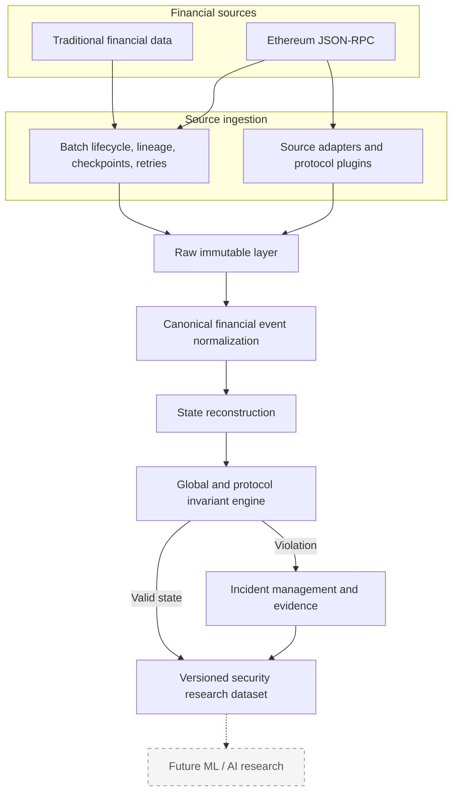

# System architecture

Sentinel separates source collection, immutable evidence, canonical financial semantics,
integrity checks, and research outputs. Ethereum is one source adapter; it does not define the
core domain.

The dashed final node is a future consumer of the dataset, not functionality included in
v0.1.0.

Related documentation:

- [Concepts](../concepts.md)
- [Detailed architecture](../architecture.md)
- [Pipeline sequence](pipeline.md)
- [Ethereum source flow](ethereum.md)
- [Incident replay flow](incident-flow.md)

