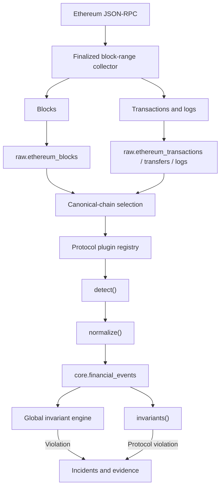

# Ethereum ingestion

Ethereum collection is bounded, finality-aware, and downstream-compatible with the same
financial event and incident pipeline used by traditional sources.

The current plugins cover ERC-20 transfers and Uniswap V2 events. Chain observations are never
deleted; reorganization handling marks orphaned observations and derived events non-canonical,
then rewinds the durable checkpoint to a known common ancestor.

See [Detailed architecture: live Ethereum ranges](../architecture.md#milestone-7-live-ethereum-ranges).

