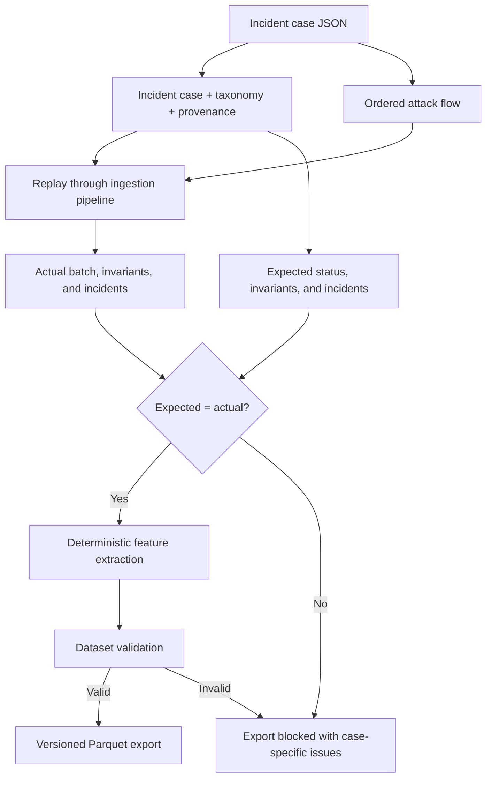

# Incident research flow

Historical cases are versioned research inputs. Replay uses the production-style ingestion and
invariant path rather than a separate simulation engine.

Validation also checks label completeness, provenance, the versioned feature set, and repeat
extraction determinism.

See [Concepts: incidents](../concepts.md#incidents) and
[Dataset validation example](../examples/dataset-validation.txt).

