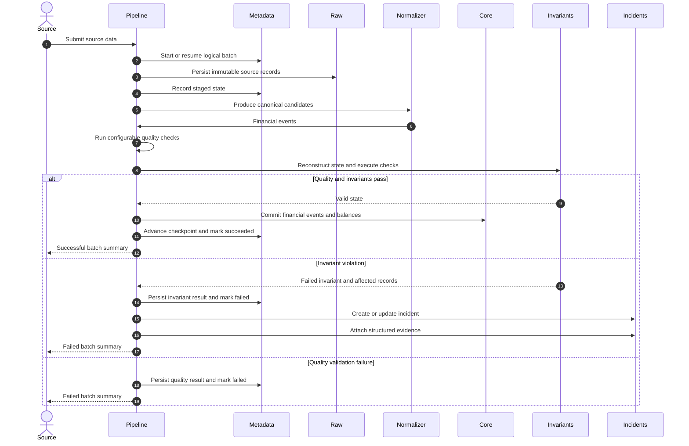

# Ingestion pipeline

Every source uses the same lifecycle after source-specific collection. Raw evidence is committed
before validation, while canonical loading, checkpoint advancement, and final success commit
together.

Retrying the same failed logical batch preserves its identity and raw evidence. Re-running a
successful logical batch is idempotent.

